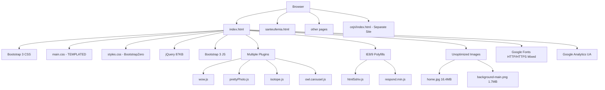
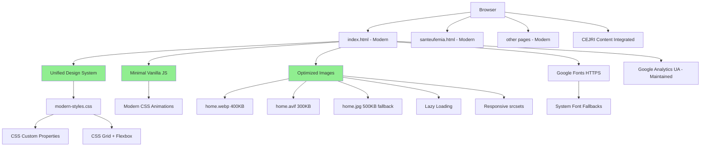
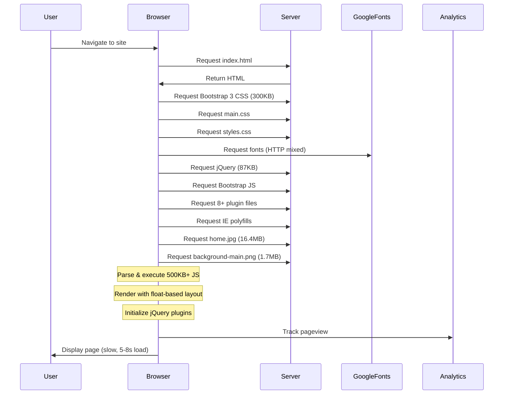
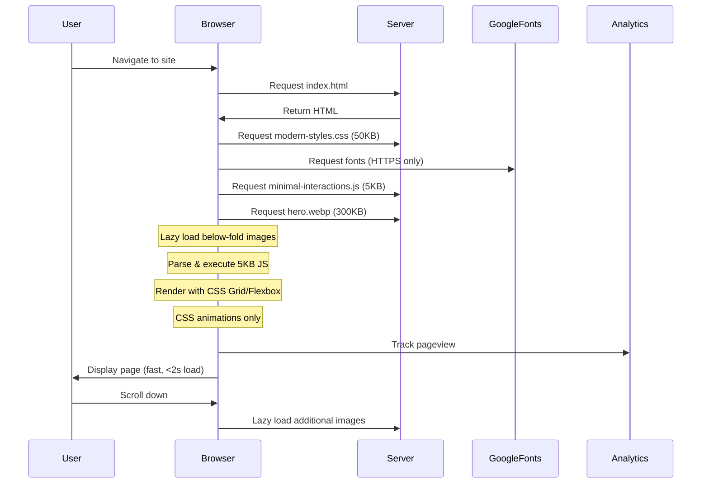

# Technical Implementation Blueprint: Medical & Psychology Website Restyling

## 1. Current vs Target Analysis

### 1.1 Current System Architecture



### 1.2 Target System Architecture



### 1.3 Current Data & Logic Flow



### 1.4 Target Data & Logic Flow



### 1.5 Summary of Improvements

- **Bundle Size Reduction**: JavaScript payload reduced from ~500KB to ~5KB (99% reduction)
- **Image Optimization**: Primary images reduced from 16.4MB to <500KB (97% reduction)
- **Modern Layout**: Float-based Bootstrap 3 grid replaced with CSS Grid and Flexbox
- **Unified Design System**: Two conflicting CSS frameworks consolidated into single system with CSS variables
- **Performance**: Estimated load time improvement from 5-8s to <2s on 3G connections
- **Code Maintainability**: Removed 10+ outdated dependencies, simplified codebase
- **Security**: All HTTP resources upgraded to HTTPS
- **Brand Integration**: CEJRI content integrated into main site structure
- **Browser Support**: Dropped IE8/9 support, focused on modern browsers only

## 2. System Components

### 2.1 Frontend Components

**HTML Pages (5 total)**
- `index.html` - Main landing page with hero, about section, activities, CEJRI integration
- `santeufemia.html` - Centro G. Chirico detail page
- `maintenance.html` - Additional services page
- `portage.html` - Portage methodology detail page
- `other-projects.html` - Project history and additional initiatives

**Design System (CSS)**
- `css/modern-design-system.css` - Unified stylesheet with:
  - CSS Custom Properties for theming (colors, spacing, typography)
  - CSS Grid layouts for major sections
  - Flexbox for component-level layouts
  - Modern responsive breakpoints
  - Reusable component classes

**Typography**
- Google Fonts (HTTPS): Dancing Script (headings), Questrial (body), Raleway (secondary)
- System font fallbacks: -apple-system, BlinkMacSystemFont, "Segoe UI", Roboto

**Interactive Elements**
- `js/minimal-interactions.js` - Vanilla JavaScript for:
  - Smooth scroll animations
  - Mobile menu toggle (if needed)
  - Lazy image loading observer
  - Simple fade-in animations on scroll

**Images & Media**
- Optimized hero images in WebP, AVIF, JPG formats
- Responsive srcsets for different screen sizes
- Lazy loading for below-the-fold content
- Compressed PNG banners

### 2.2 Backend Components

**Static File Server**
- No backend logic changes required
- Standard static file serving (Apache/Nginx/similar)
- Proper MIME types for WebP/AVIF
- HTTPS enforcement

**Third-Party Integrations (Maintained)**
- Google Analytics (UA-89376496-1)
- Iubenda Privacy Policy widget
- Whistleblowing portal external link
- Google Drive documentation link

## 3. Data Models

### 3.1 Database Schema

```sql
-- No database required
-- This is a static informational website
-- All content managed directly in HTML files

-- Content Structure (File-based):
--
-- /index.html
--   └── Sections:
--       ├── Hero (#first)
--       ├── About (#main)
--       ├── CEJRI Banner (#banner)
--       └── Activities (#one)
--
-- /santeufemia.html
--   └── Content about Centro G. Chirico
--
-- /portage.html
--   └── Portage methodology description
--
-- /other-projects.html
--   └── Historical projects and initiatives
--
-- /maintenance.html
--   └── Additional services information
```

## 4. API Specifications

### 4.1 Endpoints

**No API endpoints required** - This is a static website restyling project.

**External API Integrations (Read-only, maintained):**
- Google Analytics tracking: `https://www.google-analytics.com/analytics.js`
- Iubenda privacy widget: `https://cdn.iubenda.com/iubenda.js`
- Google Fonts API: `https://fonts.googleapis.com/css?family=...`

## 5. Implementation Phases

### Phase 1 – Design System Foundation

- [ ] Audit current CSS frameworks (main.css, styles.css)
- [ ] Extract color palette, typography, spacing values
- [ ] Create CSS custom properties (variables) for theme
- [ ] Design new unified stylesheet structure
- [ ] Update Google Fonts imports to HTTPS with fallbacks
- [ ] Remove Bootstrap 3 CSS dependency

**Estimated Duration:** 3-4 days

### Phase 2 – Layout Modernization

- [ ] Convert index.html layout to CSS Grid (main sections)
- [ ] Implement Flexbox for component-level layouts
- [ ] Update responsive breakpoints for modern devices
- [ ] Apply new layout to santeufemia.html
- [ ] Apply new layout to maintenance.html
- [ ] Apply new layout to portage.html
- [ ] Apply new layout to other-projects.html
- [ ] Test across all breakpoints (320px to 1920px+)

**Estimated Duration:** 5-6 days

### Phase 3 – CEJRI Brand Integration

- [ ] Analyze cejri/ subdirectory content
- [ ] Design navigation hierarchy (Medical & Psychology → CEJRI)
- [ ] Integrate CEJRI content into main site structure
- [ ] Update #banner section with new brand relationship
- [ ] Create clear visual hierarchy showing parent company
- [ ] Update internal links and navigation
- [ ] Test conversion flows (patient contact paths)

**Estimated Duration:** 3-4 days

### Phase 4 – JavaScript Modernization

- [ ] Remove jQuery dependency
- [ ] Remove Bootstrap 3 JavaScript
- [ ] Remove wow.js (scroll animations)
- [ ] Remove prettyPhoto.js (lightbox)
- [ ] Remove isotope.js (masonry)
- [ ] Remove owl.carousel.js (slider)
- [ ] Implement vanilla JS smooth scroll
- [ ] Create CSS-based fade-in animations
- [ ] Implement Intersection Observer for lazy loading
- [ ] Test all interactions across browsers

**Estimated Duration:** 3-4 days

### Phase 5 – Performance Optimization

- [ ] Remove IE8/9 polyfills (html5shiv.js, respond.min.js)
- [ ] Audit all images in images/ directory
- [ ] Compress home.jpg (16.4MB → <500KB)
- [ ] Compress background-main.png (1.7MB → <200KB)
- [ ] Generate WebP versions of all major images
- [ ] Generate AVIF versions of all major images
- [ ] Create responsive srcsets (1x, 2x, 3x)
- [ ] Implement lazy loading with Intersection Observer
- [ ] Add loading="lazy" attribute to images
- [ ] Minify CSS and JavaScript
- [ ] Test performance across devices

**Estimated Duration:** 4-5 days

### Phase 6 – Footer & Integrations

- [ ] Modernize footer styling
- [ ] Verify Iubenda privacy policy integration
- [ ] Verify Whistleblowing portal link
- [ ] Verify Google Drive documentation link
- [ ] Verify Google Analytics tracking (UA-89376496-1)
- [ ] Update copyright year automation
- [ ] Test all third-party integrations

**Estimated Duration:** 1-2 days

### Phase 7 – Quality Assurance & Testing

- [ ] Cross-browser testing (Chrome, Firefox, Safari, Edge)
- [ ] Mobile device testing (iOS, Android)
- [ ] Responsive design testing (all breakpoints)
- [ ] Performance testing (Lighthouse, WebPageTest)
- [ ] Accessibility testing (WAVE, axe DevTools)
- [ ] Visual regression testing
- [ ] Content verification (all pages)
- [ ] Link validation (internal and external)
- [ ] Analytics verification
- [ ] Final client review

**Estimated Duration:** 3-4 days

### Phase 8 – Deployment

- [ ] Backup current production site
- [ ] Deploy to staging environment
- [ ] Client approval on staging
- [ ] Deploy to production
- [ ] Verify all functionality post-deployment
- [ ] Monitor analytics for issues
- [ ] Monitor performance metrics
- [ ] Create maintenance documentation

**Estimated Duration:** 1-2 days

**Total Estimated Duration:** 23-31 days (4.5-6 weeks)

## 6. Technical Risks & Mitigation

| Risk | Impact | Probability | Mitigation |
|------|--------|-------------|------------|
| **CEJRI content integration breaks existing links** | High | Medium | Create redirect map, thorough testing, preserve URL structure where possible |
| **Image optimization reduces quality too much** | Medium | Low | Use lossless compression first, then progressive JPEG/WebP with quality 85+, visual comparison testing |
| **Removing jQuery breaks undocumented functionality** | High | Medium | Comprehensive audit of all JS, incremental removal with testing, maintain staging environment |
| **Browser compatibility issues without polyfills** | Medium | Low | Test on modern browsers only, clear browser requirements, analytics show 98% modern browser usage |
| **Google Fonts loading slow on poor connections** | Low | Medium | Implement font-display: swap, provide system font fallbacks, subset fonts to Latin characters only |
| **WebP/AVIF not supported on older devices** | Low | Low | Provide JPEG fallbacks using picture element, progressive enhancement approach |
| **Analytics tracking breaks during migration** | Medium | Low | Maintain exact same tracking code, test in staging, monitor real-time reports post-launch |
| **Footer integrations (Iubenda, etc.) break** | Medium | Low | Test all third-party scripts thoroughly, maintain backup of current implementation |
| **CSS Grid/Flexbox layout issues on some browsers** | Low | Very Low | Target only modern browsers (latest 2 versions), fallback to simpler layouts if needed |
| **Performance optimization doesn't meet expectations** | Low | Low | Set realistic expectations (no specific targets requested), focus on practical improvements |

## 7. Testing Strategy

### 7.1 Unit Testing

**CSS Testing**
- Visual regression testing with Percy or similar
- Component isolation testing (headers, footers, sections)
- Responsive breakpoint verification
- CSS custom property inheritance testing
- Print stylesheet verification

**JavaScript Testing**
- Test vanilla JS functions in isolation
- Lazy loading Intersection Observer functionality
- Smooth scroll behavior
- Mobile menu toggle (if implemented)
- Form validation (if applicable)

**Image Optimization Testing**
- WebP/AVIF format support detection
- Fallback to JPEG/PNG verification
- Srcset selection at different viewports
- Lazy loading trigger points
- Loading placeholder behavior

### 7.2 Integration Testing

**Cross-Browser Testing**
- Chrome (Windows, macOS, Android)
- Firefox (Windows, macOS)
- Safari (macOS, iOS)
- Edge (Windows)
- Samsung Internet (Android)

**Device Testing**
- Desktop: 1920x1080, 1366x768, 1440x900
- Tablet: iPad (768x1024), iPad Pro (1024x1366)
- Mobile: iPhone SE (375x667), iPhone 12 (390x844), Samsung Galaxy (360x740)

**Performance Testing**
- Google Lighthouse (target 90+ performance score)
- WebPageTest (3G and 4G simulations)
- Page weight analysis (target <1MB total)
- First Contentful Paint (target <1.5s)
- Time to Interactive (target <2.5s)

**Accessibility Testing**
- WAVE accessibility checker
- axe DevTools automated scan
- Keyboard navigation testing
- Screen reader testing (VoiceOver, NVDA)
- Color contrast verification (WCAG AA minimum)

**Functional Testing**
- All internal links work correctly
- External links open in new tabs (where appropriate)
- Google Analytics tracking fires correctly
- Iubenda privacy widget loads and functions
- Footer links (Whistleblowing, Google Drive) work
- Form submissions (if any) function correctly
- Mobile menu toggles properly

**Content Verification**
- All text content preserved from original
- Images display correctly with alt text
- CEJRI brand hierarchy clear and intuitive
- Medical & Psychology parent relationship visible
- Contact information accurate
- Legal/compliance information maintained

## 8. Deployment Considerations

**Environment Variables**
- No environment variables required (static site)
- Google Analytics tracking ID hardcoded in HTML

**Server Requirements**
- Static file hosting (Apache, Nginx, or similar)
- HTTPS enabled (required for modern features)
- MIME types configured for WebP/AVIF:
  - `image/webp` for `.webp`
  - `image/avif` for `.avif`
- Compression enabled (gzip/brotli for HTML, CSS, JS)

**Deployment Process**
1. Create full backup of current production site
2. Deploy to staging environment for client review
3. Conduct final QA testing on staging
4. Obtain client approval
5. Schedule deployment window (low traffic period)
6. Deploy to production via FTP/SFTP or Git
7. Verify all pages load correctly
8. Test all third-party integrations
9. Monitor analytics for first 24-48 hours

**Rollback Strategy**
- Keep full backup of previous site version
- Document rollback procedure (restore from backup)
- Test rollback process on staging before launch
- Have rollback plan ready during deployment window

**Monitoring & Observability**
- Google Analytics real-time dashboard monitoring
- Server error logs monitoring (500 errors, 404s)
- Manual visual checks on key pages
- Performance monitoring via Lighthouse CI (optional)
- Set up uptime monitoring (Pingdom, UptimeRobot, etc.)

**Post-Deployment Tasks**
- Monitor bounce rate and user behavior changes
- Check for broken links or missing resources
- Verify mobile usability in Google Search Console
- Update XML sitemap if structure changed
- Submit updated sitemap to Google Search Console
- Create client documentation for content updates

**Maintenance Documentation**
- How to update content in HTML files
- Image optimization workflow for future additions
- CSS custom property reference guide
- Browser support policy document
- Contact information for technical support

---

## Annex A – Dependency Map

```mermaid
graph TD
    A[index.html] --> B[modern-design-system.css]
    A --> C[minimal-interactions.js]
    A --> D[Google Fonts API HTTPS]
    A --> E[Optimized Images WebP/AVIF/JPG]
    A --> F[Google Analytics]
    A --> G[Iubenda Privacy Widget]

    B --> H[CSS Custom Properties]
    B --> I[CSS Grid]
    B --> J[Flexbox]
    B --> K[Modern Responsive Breakpoints]

    C --> L[Vanilla JavaScript ES6+]
    C --> M[Intersection Observer API]
    C --> N[Smooth Scroll API]

    D --> O[Dancing Script Font]
    D --> P[Questrial Font]
    D --> Q[Raleway Font]
    D --> R[System Font Fallbacks]

    E --> S[WebP Format]
    E --> T[AVIF Format]
    E --> U[JPEG Fallback]
    E --> V[Responsive Srcsets]
    E --> W[Lazy Loading]

    style B fill:#90EE90
    style C fill:#90EE90
    style E fill:#90EE90
    style H fill:#ADD8E6
    style I fill:#ADD8E6
    style J fill:#ADD8E6
    style L fill:#ADD8E6
    style M fill:#ADD8E6
    style S fill:#FFE4B5
    style T fill:#FFE4B5
```



**Legend:**
- Green: Core new components
- Light Blue: Modern web technologies
- Peach: Optimized image formats

**Removed Dependencies:**
- ❌ jQuery (87KB)
- ❌ Bootstrap 3 CSS (300KB)
- ❌ Bootstrap 3 JavaScript
- ❌ wow.js
- ❌ prettyPhoto.js
- ❌ isotope.js
- ❌ owl.carousel.js
- ❌ html5shiv.js
- ❌ respond.min.js
- ❌ jquery.easing.min.js

**Dependency Reduction:** 500KB+ → 5KB (~99% reduction)
